# Database Schema Design

## Entity Relationship Diagram

```mermaid
erDiagram
    USERS ||--o{ USER_PROFILES : has
    USERS ||--o{ WALLET_TRANSACTIONS : owns
    USERS ||--o{ GAME_SESSIONS : plays
    USERS ||--o{ USER_ROLES : assigned
    USERS ||--o{ REFERRALS : referred
    USERS ||--o{ USER_SESSIONS : logs_in
    ROLES ||--o{ USER_ROLES : assigned
    GAMES ||--o{ GAME_SESSIONS : includes
    GAMES ||--o{ GAME_CATEGORIES : belongs_to
    PROMOTIONS ||--o{ USER_PROMOTIONS : offers
    WALLET_TRANSACTIONS ||--|| TRANSACTION_TYPES : classified_as
    SUPPORT_TICKETS ||--o{ SUPPORT_MESSAGES : contains
    USERS ||--o{ SUPPORT_TICKETS : creates
    ADMIN_USERS ||--o{ ADMIN_SESSIONS : logs_in
    ADMIN_USERS ||--o{ AUDIT_LOGS : generates
    
    USERS {
        int id PK
        string username
        string email
        string password_hash
        string phone_number
        date date_of_birth
        string full_name
        boolean email_verified
        boolean phone_verified
        boolean is_active
        boolean is_suspended
        datetime created_at
        datetime updated_at
        datetime last_login
    }
    
    USER_PROFILES {
        int id PK
        int user_id FK
        string avatar_url
        string bio
        string country
        string city
        string timezone
        json preferences
        datetime created_at
        datetime updated_at
    }
    
    ROLES {
        int id PK
        string name
        string description
        datetime created_at
    }
    
    USER_ROLES {
        int id PK
        int user_id FK
        int role_id FK
        datetime assigned_at
    }
    
    WALLET_TRANSACTIONS {
        int id PK
        int user_id FK
        int transaction_type_id FK
        decimal amount
        decimal balance_after
        string currency
        string reference_id
        string description
        string status
        datetime created_at
        datetime processed_at
    }
    
    TRANSACTION_TYPES {
        int id PK
        string name
        string description
    }
    
    GAMES {
        int id PK
        int category_id FK
        string name
        string description
        string provider
        string thumbnail_url
        boolean is_active
        decimal min_bet
        decimal max_bet
        decimal house_edge
        json game_config
        datetime created_at
        datetime updated_at
    }
    
    GAME_CATEGORIES {
        int id PK
        string name
        string description
        boolean is_active
        datetime created_at
    }
    
    GAME_SESSIONS {
        int id PK
        int user_id FK
        int game_id FK
        string session_token
        json game_state
        decimal bet_amount
        decimal win_amount
        string status
        datetime started_at
        datetime ended_at
    }
    
    PROMOTIONS {
        int id PK
        string name
        string description
        string type
        json configuration
        datetime start_date
        datetime end_date
        boolean is_active
        datetime created_at
        datetime updated_at
    }
    
    USER_PROMOTIONS {
        int id PK
        int user_id FK
        int promotion_id FK
        string status
        json usage_data
        datetime claimed_at
        datetime expired_at
    }
    
    REFERRALS {
        int id PK
        int referrer_id FK
        int referred_id FK
        string referral_code
        decimal bonus_amount
        string status
        datetime created_at
        datetime converted_at
    }
    
    SUPPORT_TICKETS {
        int id PK
        int user_id FK
        string subject
        string category
        string priority
        string status
        datetime created_at
        datetime updated_at
        datetime closed_at
    }
    
    SUPPORT_MESSAGES {
        int id PK
        int ticket_id FK
        int sender_id
        string sender_type
        text message
        datetime sent_at
    }
    
    USER_SESSIONS {
        int id PK
        int user_id FK
        string session_token
        string ip_address
        string user_agent
        datetime created_at
        datetime expires_at
    }
    
    ADMIN_USERS {
        int id PK
        string username
        string email
        string password_hash
        string full_name
        boolean is_active
        boolean is_super_admin
        datetime last_login
        datetime created_at
        datetime updated_at
    }
    
    ADMIN_SESSIONS {
        int id PK
        int admin_user_id FK
        string session_token
        string ip_address
        string user_agent
        datetime created_at
        datetime expires_at
    }
    
    AUDIT_LOGS {
        int id PK
        int admin_user_id FK
        string action
        string entity_type
        int entity_id
        json old_values
        json new_values
        string ip_address
        datetime created_at
    }
```

## Table Descriptions

### USERS
Stores basic user information including authentication credentials.

### USER_PROFILES
Extended user profile information including preferences and personal details.

### ROLES & USER_ROLES
Role-based access control system for managing user permissions.

### WALLET_TRANSACTIONS & TRANSACTION_TYPES
Financial transaction tracking system with different transaction types (deposit, withdrawal, bonus, etc.).

### GAMES & GAME_CATEGORIES
Game library management with categorization.

### GAME_SESSIONS
Tracks individual game playing sessions with betting information.

### PROMOTIONS & USER_PROMOTIONS
Marketing promotions and user claims tracking.

### REFERRALS
Referral program tracking with bonuses.

### SUPPORT_TICKETS & SUPPORT_MESSAGES
Customer support system with ticketing and messaging.

### USER_SESSIONS
User session management for security and tracking.

### ADMIN_USERS, ADMIN_SESSIONS & AUDIT_LOGS
Administrative user management with audit trails.